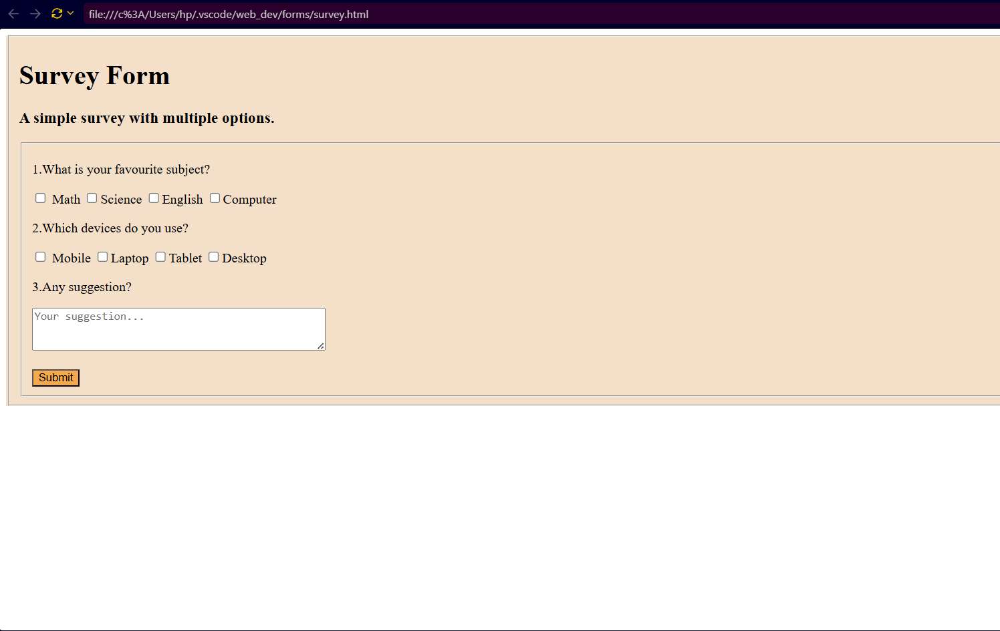

# HTML Survey Form

## 📌 Project Description

This project is a simple and user-friendly Survey Form created using HTML and CSS.

The purpose of this project is to collect responses from users through different form fields such as text inputs, radio buttons, checkboxes, dropdown menus, and text areas.

## 🚀 Features

- Simple and clean user interface
- User name and email input fields
- Radio buttons for selecting options
- Checkboxes for multiple selections
- Dropdown menu
- Feedback text area
- Submit button
- Responsive and easy-to-use design

## 🛠️ Technologies Used

- HTML5
- CSS3
## Screenshot



## 📂 Project Structure

```text
html_survey_form/
│
├── index.html
├── survey.css
├── survey_html_ss.png
└── README.md
